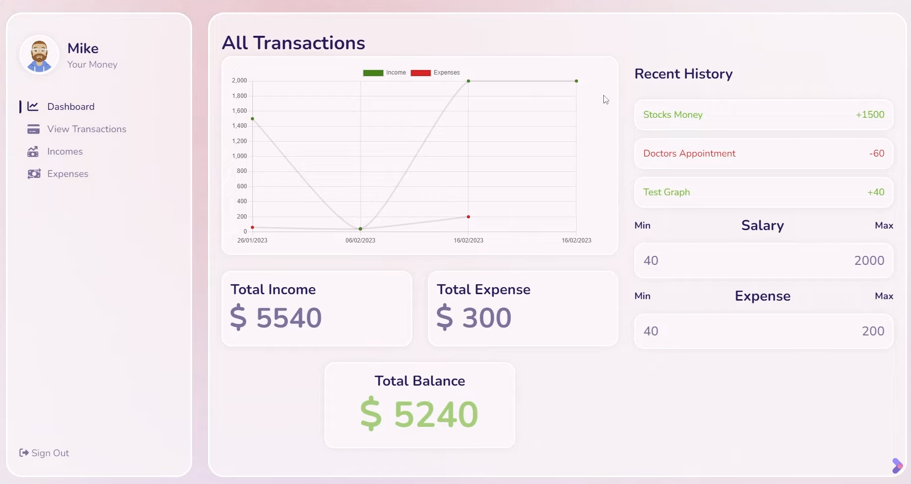

# Requirement and Design Document 
## Introduction
### Purpose
The purpose of this document is to outline the requirements for the development of an CashCraft Pro application using the MERN (MongoDB, Express.js, React.js, Node.js) stack. This application aims to provide users with a seamless and efficient way to track and manage their expenses.

### Scope
The Expense Tracker will allow users to record, categorize, and analyze their expenses. It will provide features for adding, updating, and deleting transactions, as well as generating insightful reports based on the recorded data.

## Functional Requirements
### User Authentication
- Users should be able to register an account.
- Users should be able to log in securely.
- The system must support password recovery and reset functionalities.
### Expense Management
- Users should be able to add a new expense, including details such as date, amount, category, and description.
Expenses must be categorized to enable better analysis.
- Users should be able to update and delete existing expenses.

### Dashboard
- The system must provide a user-friendly dashboard displaying an overview of the user's expenses.
- The dashboard should include charts and graphs representing expense distribution over time and by category.

### Notifications
Users should receive notifications for upcoming bills or reminders to log expenses.

## Non-functional Requirements
### Performance
- The application should respond to user interactions within 2 seconds.
- The system must handle concurrent users efficiently.
### Security
- User data must be encrypted both in transit and at rest.
- Authorization mechanisms should be implemented to control access to specific features.
### Scalability
The system should handle a growing number of users and data points without significant degradation in performance.

# Design 
## Architecture
### Overview
The Expense Tracker will be developed using the MERN stack, with MongoDB serving as the database, Express.js for the server, React.js for the client-side, and Node.js as the runtime environment.

### Database Design
The MongoDB database will consist of collections for users, expenses, and categories. A relational structure will be maintained to link expenses to their corresponding users.

## Frontend Design
### React Components
- The application will be structured into components such as Login, Registration, Dashboard, ExpenseForm, ExpenseList, and Report.

### State Management
- Redux will be implemented for state management to maintain a predictable and centralized state.

## Backend Design
### Express Routes
- RESTful API routes will be implemented for user authentication, expense management, and reporting.

### Middleware
- Middleware will be utilized for authentication, error handling, and logging.

## Security Design
### Authentication
- JSON Web Tokens (JWT) will be used for secure user authentication.

### Encryption
- Sensitive data, such as user passwords, will be hashed using bcrypt before storage.

## Deployment
### Hosting
The application will be deployed on a cloud platform such as AWS or Heroku.

# Conclusion
This requirement and design document provides a comprehensive overview of the functionality and design considerations for the MERN Stack Expense Tracker project. The outlined specifications aim to ensure the development of a robust, scalable, and secure application that meets user expectations.

